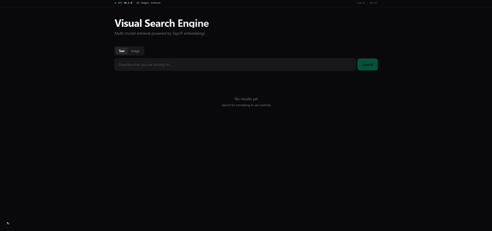
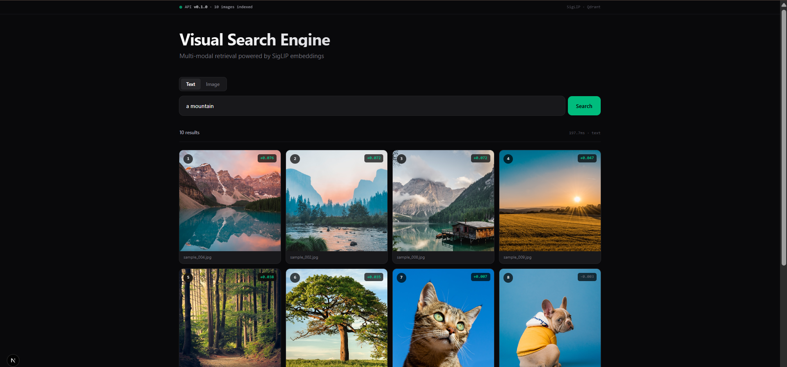
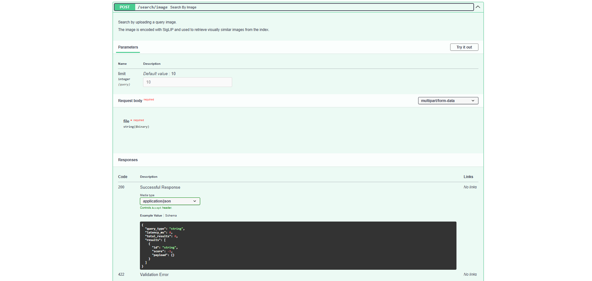

# Visual Search Engine
# 視覺搜尋引擎

> **Multi-Modal Image Retrieval Platform** — Production-grade visual search powered by SigLIP embeddings and Qdrant vector database.
>
> **多模態圖像檢索平台** — 由 SigLIP 嵌入向量與 Qdrant 向量資料庫驅動的生產級視覺搜尋系統。

[](https://www.python.org/)
[](https://fastapi.tiangolo.com/)
[](https://nextjs.org/)
[](https://qdrant.tech/)
[](LICENSE)

---

## Demo / 演示

### Dashboard / 儀表板

<p align="center">
  
</p>

### Search Results / 搜尋結果

<p align="center">
  
</p>

### REST API / REST API

<p align="center">
  
</p>

---

## Why Visual Search Engine? / 為何選擇此專案？

Visual search powers products like Google Lens, Pinterest, and Marketplace. Most tutorial implementations stop at "extract embeddings, run cosine similarity." This project addresses the engineering challenges that matter in production: latency, scale, observability, and multi modal retrieval quality.

視覺搜尋是 Google Lens、Pinterest 與 Marketplace 等產品的核心技術。多數教學範例僅止於「提取嵌入向量，計算餘弦相似度」。本專案進一步處理生產環境中真正關鍵的議題：延遲、規模、可觀測性以及多模態檢索品質。

The system encodes images and text queries into a shared 768 dimensional embedding space using SigLIP, then performs approximate nearest neighbor search through Qdrant HNSW indexing.

系統使用 SigLIP 將圖片與文字查詢編碼至共享的 768 維嵌入空間，再透過 Qdrant 的 HNSW 索引執行近似最近鄰搜尋。

---

## Tech Stack / 技術堆疊

| Component / 元件 | Technology / 技術 |
|------------------|-------------------|
| Embedding Model | SigLIP base patch16 224 (Hugging Face) |
| Vector Database | Qdrant 1.12 with HNSW index |
| Backend API | FastAPI (Python) |
| Cache | Redis 7.4 |
| Task Queue | Celery 5.4 |
| Frontend | Next.js 16 + TypeScript + TailwindCSS |
| Containerization | Docker Compose |
| Monitoring | Prometheus + Grafana |

---

## Architecture / 系統架構

```
+-------------------------------------------------+
|         Visual Search Engine Platform            |
+-------------------------------------------------+
|                                                  |
|  Frontend  -->  FastAPI  -->  SigLIP Encoder    |
|  (Next.js)      (Python)      (PyTorch)         |
|                    |                             |
|                    v                             |
|              Qdrant + Redis                      |
|              (HNSW search)                       |
|                                                  |
|  Workers  -->  Indexing Pipeline                 |
|  (Celery)      (Async batching)                  |
|                                                  |
|  Monitoring (Prometheus + Grafana)               |
+-------------------------------------------------+
```

---

## Features / 主要功能

* Cross modal retrieval with text or image queries
* 跨模態檢索，支援文字或圖片查詢
* Sub second latency on commodity hardware (CPU only)
* 一般硬體（僅 CPU）達成亞秒級延遲
* Production grade error handling and validation
* 生產級錯誤處理與驗證
* Async REST API with auto generated OpenAPI documentation
* 非同步 REST API，附自動生成的 OpenAPI 文件
* Real time backend health monitoring in the frontend
* 前端即時顯示後端服務健康狀態
* Modern dark themed dashboard built with Next.js 16
* 以 Next.js 16 打造的現代深色主題儀表板
* Prometheus metrics instrumentation for observability
* Prometheus 指標監控以提供可觀測性
* Docker Compose orchestration for local development
* 用於本機開發的 Docker Compose 編排

---

## Quick Start / 快速開始

**Prerequisites / 前置需求:** Python 3.10+, Node.js 20+, Docker Desktop, 8GB RAM minimum.

**前置需求：** Python 3.10+、Node.js 20+、Docker Desktop，至少 8GB 記憶體。

Clone the repository:

```bash
git clone https://github.com/Venta02/visual-search-engine.git
cd visual-search-engine
```

Install Python dependencies and configure environment:

```bash
pip install -r requirements.txt
cp .env.example .env
```

Start infrastructure services:

```bash
docker compose up -d qdrant redis
```

Download sample dataset and build index:

```bash
python scripts/download_sample_dataset.py
python scripts/build_index.py --dataset data/raw/sample --batch-size 8
```

Run the API server:

```bash
uvicorn src.api.main:app --host 0.0.0.0 --port 8000
```

Run the frontend in a separate terminal:

```bash
cd frontend/nextjs_app
npm install
npm run dev
```

Open `http://localhost:3000` to interact with the application.

開啟 `http://localhost:3000` 即可使用應用程式。

---

## API Endpoints / API 端點

| Method | Path | Description / 說明 |
|--------|------|--------------------|
| GET | /health | Service health and indexed count / 服務健康狀態 |
| POST | /search/text | Search by text query / 文字查詢搜尋 |
| POST | /search/image | Search by uploaded image / 圖片上傳搜尋 |
| GET | /images/{id} | Serve indexed image / 提供索引圖片 |
| GET | /metrics | Prometheus metrics / Prometheus 指標 |
| GET | /docs | OpenAPI documentation / OpenAPI 文件 |

---

## Performance Targets / 效能目標

| Metric / 指標 | Target / 目標 |
|---------------|---------------|
| p50 search latency / p50 搜尋延遲 | under 50ms |
| p95 search latency / p95 搜尋延遲 | under 100ms |
| Throughput per replica / 單副本吞吐量 | over 100 RPS |
| Recall@10 vs brute force / 召回率對比暴力搜尋 | over 95 percent |

---

## Roadmap / 路線圖

Phase 1 MVP and Foundation (complete) / 第一階段 MVP 與基礎建設（已完成）:

* [x] Project skeleton with Docker setup
* [x] SigLIP embedding service with batching
* [x] Qdrant integration with HNSW indexing
* [x] FastAPI endpoints for search and indexing
* [x] Next.js frontend with dark theme
* [x] CLI indexing pipeline
* [x] End to end smoke test

Phase 2 Production Engineering / 第二階段 生產工程:

* [ ] Hybrid search combining image, text, and metadata filters
* [ ] Redis caching layer with TTL strategy
* [ ] Async indexing pipeline with Celery
* [ ] JWT authentication and rate limiting
* [ ] Comprehensive test suite
* [ ] Load testing with Locust

Phase 3 Optimization / 第三階段 最佳化:

* [ ] FP16 and INT8 quantization with ONNX Runtime
* [ ] Benchmark report comparing HNSW, IVF PQ, and Flat
* [ ] Cold start optimization
* [ ] Distributed Qdrant deployment with sharding

Phase 4 Distribution / 第四階段 發布:

* [ ] Hugging Face Space deployment
* [ ] Technical blog post
* [ ] Demo video on YouTube

---

## Project Structure / 專案結構

```
visual-search-engine/
  src/
    api/              FastAPI routes and dependencies
    core/             Configuration, logging, metrics
    services/
      embedding/      SigLIP wrapper and batching
      search/         Qdrant client wrapper
      indexing/       Bulk indexing pipeline
    models/           Pydantic schemas
    workers/          Celery task definitions
  frontend/
    nextjs_app/       Production frontend (Next.js 16)
    streamlit_app/    MVP frontend (Streamlit)
  scripts/            CLI utilities
  monitoring/         Prometheus and Grafana configs
  docker-compose.yml
  README.md
```

---

## References / 參考資料

Papers / 論文:

* Radford et al. 2021. Learning Transferable Visual Models From Natural Language Supervision (CLIP). arxiv.org/abs/2103.00020
* Zhai et al. 2023. Sigmoid Loss for Language Image Pre Training (SigLIP). arxiv.org/abs/2303.15343
* Malkov and Yashunin 2018. Hierarchical Navigable Small World graphs. arxiv.org/abs/1603.09320

Documentation / 文件:

* Qdrant: qdrant.tech/documentation
* FastAPI: fastapi.tiangolo.com
* Hugging Face Transformers: huggingface.co/docs/transformers

---

## License / 授權

MIT License. See [LICENSE](LICENSE) for details.

MIT 授權。詳情請見 [LICENSE](LICENSE)。

---

## Author

**Embun Ventani**

* GitHub: [@Venta02](https://github.com/Venta02)
* LinkedIn: [embun ventani](https://linkedin.com/in/embun-ventani-34ba50206)
* Email: embunventa02@gmail.com

---

<p align="center">
  <strong>Searching the visual world, one embedding at a time.</strong><br/>
  <strong>每一個嵌入向量，探索視覺世界。</strong>
</p>
